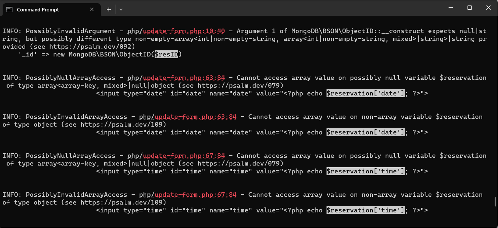
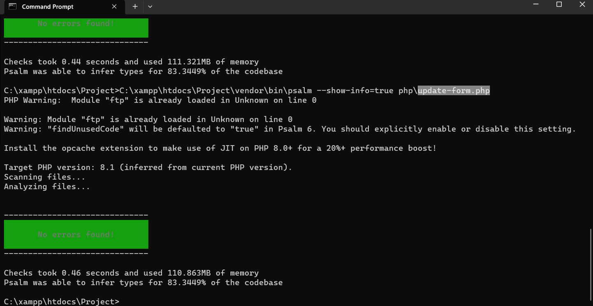
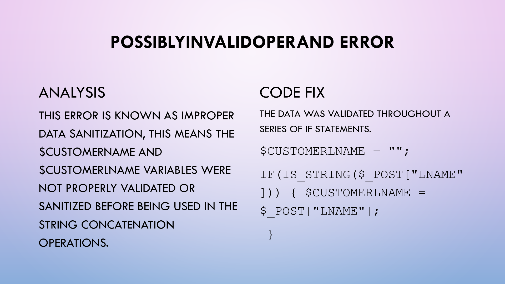

# Bella Italia Web Application Testing Project

A security-focused QA project using static code analysis to identify and resolve vulnerabilities in a web application.

## Overview

This project is based on a web-based booking application developed for a restaurant using HTML, CSS, PHP, and MongoDB. The application includes core functionalities such as user registration and login, reservation creation and management, and a staff dashboard for viewing customer and booking data. Static code analysis was conducted using Psalm to identify, analyze, and resolve vulnerabilities, improving the overall security and reliability of the application.

## Objectives

Develop a software application
Validate core functionality of the web application
Identify and document defects
Ensure the application meets expected requirements
Practice structured software testing methodologies

## Scope of Testing

The following areas were tested:

User interface (UI) functionality

Form validation

Navigation and user flow

Data input and output behavior

Edge cases and error handling

## Testing Approach

**Testing Type:**

Static Code Analysis (White-box testing)
Manual validation of fixes

**Tools Used:**

Psalm (Static Code Analysis Tool)
PHP
MongoDB

**Process:**

Analyzed source code using Psalm

Identified and categorized vulnerabilities

Investigated root causes of defects

Applied fixes to the codebase

Re-ran analysis to confirm resolution

## Key Findings

Psalm identified 150 vulnerabilities in the PHP web application during static code analysis.

The most common issues involved invalid or missing input validation, unsafe argument handling, null array access, object-versus-array access errors, deprecated methods, and insecure debug code left in the application.

Vulnerabilities were found across core application flows including customer registration, login, reservation creation, reservation updates, and the staff dashboard.

After fixes were implemented, Psalm was rerun and the reported vulnerabilities in the analyzed files were resolved.

## Vulnerabilities Analysis and Fixes

#### Unsafe date handling in add\_res.php

**Issue:** The argument passed to strtotime() might not be a string, which could lead to incorrect reservation date processing.

**Impact:** Malformed or unexpected input could disrupt reservation timing and system behavior.

**Fix:** Added validation to ensure the submitted date value was a string before processing it

#### Invalid reservation lookup in update-form.php

**Issue:** The reservation ID passed into MongoDB\\BSON\\ObjectId was not guaranteed to be a string, and reservation data could be accessed even when null.

**Impact:** This could cause runtime errors or unexpected behavior when loading reservation updates.

**Fix:** Added validation for reservation ID input and typecast the returned reservation object before access.

#### Null and invalid array access in staffWel.php

**Issue:** Reservation and customer data were accessed without sufficient checks, even though the values could be null or objects rather than arrays.

**Impact:** This could cause runtime errors and expose customer/reservation data to misuse if exploited.

**Fix:** Typecast database results to arrays and added checks to confirm values existed before access.

## Presentation

## Key Learnings

Developed a strong understanding of the software testing lifecycle (STLC), including designing effective test cases, identifying vulnerabilities, and clearly documenting issues. Gained practical experience using static code analysis to detect and fix security flaws, reinforcing the importance of validating input and handling edge cases. This project emphasized the importance of thorough testing before deployment and adopting a security-focused mindset when building and evaluating software.

